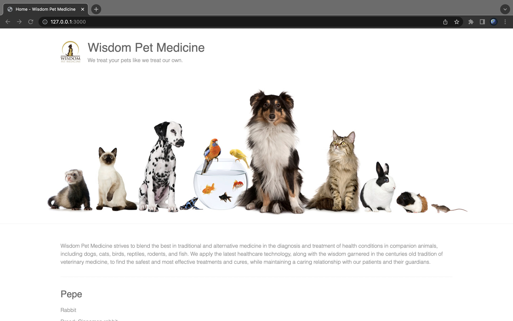
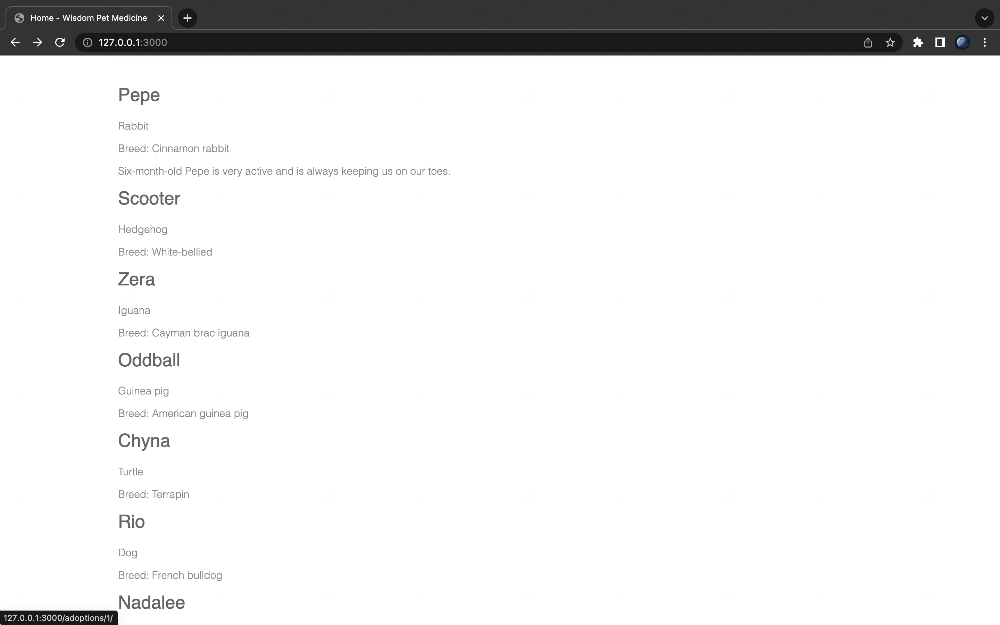
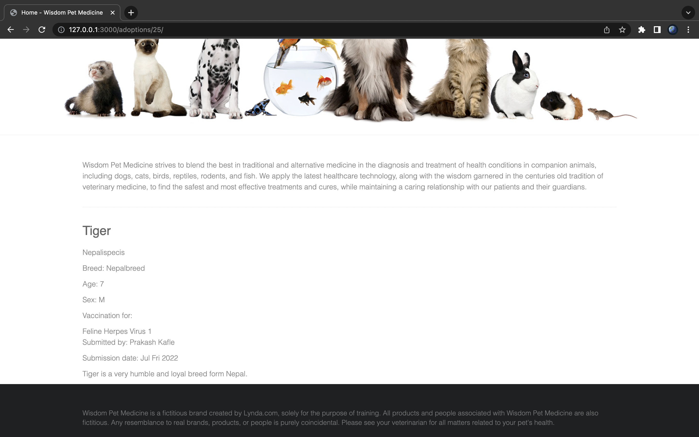

Welcome to the <i> Django Pet Management System </i>.
This app keeps the track of pet vaccination.

Prerequisites

Before you begin, make sure you have the following:

Python 3.6 or newer
Django 3.1 or newer
Installation

To install the app, follow these steps:

Clone the repository
Navigate to the root directory of the repository i.e. wisdompets.
</br>
Run the following command to install the required packages:

```
pip install -r requirements.txt
```

Usage

To start the development server, run the following command:

```
python manage.py runserver
```

Then, visit http://localhost:8000 in your web browser to view the app.


It should look like below:



</br>


</br>


  </br>

<b><i style="size:30px;">Note:</i></b>

The above screenshots run on port 3000

To run the project on your desired port, use the following command:

python manage.py runserver your_port_number

```
python manage.py runserver 3000
```


